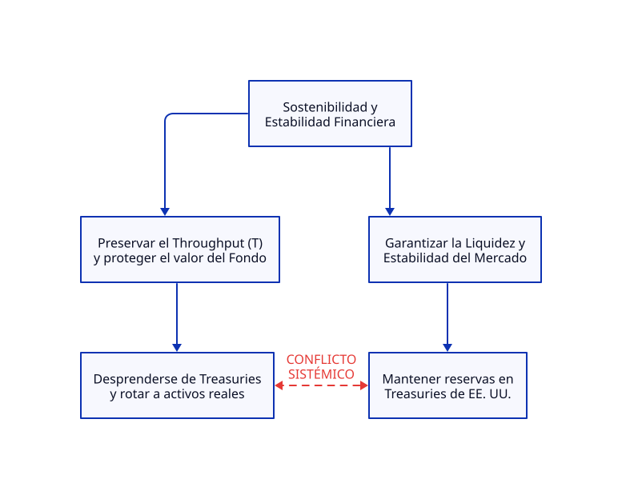

# BOLETÍN IES 02 - TERMODINÁMICA FINANCIERA

2026-09-09

**Edición Especial:** Finanzas Soberanas y Mercado Global de Deuda

**Análisis:** La saturación del mercado de Treasuries ante la liquidación sincronizada de Fondos Soberanos y Bancos Centrales

https://www.bnnbloomberg.ca/investing/investor-outlook/2026/09/04/norways-us2-trillion-sovereign-fund-proposes-deep-cuts-to-us-treasury-holdings/

https://www.cnbc.com/2026/09/07/japan-foreign-reserves-yen-intervention.html

---

## 1. Titular y Resumen Ejecutivo

### **Titular:** La trampa de liquidez soberana: Noruega y Japón tensionan la restricción del mercado monetario global

**Resumen Ejecutivo:**

El anuncio del Fondo Soberano de Noruega (NBIM) de recortar casi $80 billones de dólares en bonos del Tesoro de EE. UU., sumado a la venta de ~$80 billones en reservas por parte del Banco de Japón (BoJ) para sostener el yen, ha dejado al descubierto la restricción estructural del sistema financiero internacional. La venta coordinada e involuntariamente sincronizada de $160 billones de dólares en *U.S. Treasuries* desborda la capacidad marginal de absorción del mercado de deuda. Lo que la ortodoxia interpreta como ajustes independientes de cartera o liquidez, desde la Teoría de Restricciones (TOC) es un choque directo sobre la restricción del sistema: la liquidez nominal no garantiza la preservación del valor si el rendimiento real (**T**) se destruye por el exceso de inventario soberano (**I**).

---

## 2. Diagnóstico del Sistema según TOC

### **A. La Restricción del Sistema (Cuello de Botella)**

El cuello de botella del sistema financiero global no es la masa monetaria disponible, sino la **Capacidad Marginal de Absorción de Deuda Soberana sin Desplazar las Tasas de Interés (*Yield Spikes*)**. El mercado de emisión de *Treasuries* está saturado; exigir mayor absorción a los compradores marginales (fondos privados) obliga al sistema a pagar tasas sustancialmente más altas, encareciendo el crédito mundial y ahogando la inversión productiva.

### **B. Parámetros Clave de Goldratt**

* **Throughput (T):** La generación de rendimiento neto real ajustado por inflación y riesgo. $T$ se está reduciendo significativamente debido al deterioro de los precios de los bonos sovereign y la volatilidad.
* **Inversión / Inventario (**I**):** Representado por las tenencias masivas de *U.S. Treasuries* ($215 billones en el caso de NBIM, $1.21 billones en reservas de Japón). Esta deuda acumulada funciona como "Inventario Inmovilizado" con elevadas pérdidas latentes a medida que las tasas suben.
* **Gasto de Operación (**OE**):** Los costos financieros y de oportunidad necesarios para sostener el sistema, incluyendo las intervenciones en el mercado cambiario del BoJ y el creciente costo del servicio de la deuda pública estadounidense.

### **C. Herramienta de Procesos de Pensamiento: Nube de Evaporación del Conflicto (Evaporating Cloud)**

* **Premisa Falsa Evaporada:** *"Los U.S. Treasuries son el único activo infinitamente líquido y exento de riesgo de mercado para la reserva de capitales soberanos."*
* **Inyección TOC:** La sustitución de deuda gubernamental por crédito corporativo, hipotecas (*MBS*) y activos reales genera mayor Throughput sin comprometer la liquidez operativa requerida por los fondos soberanos.

---

## 3. Dicotomía Clave 1: Contabilidad de Costos Tradicional vs. Contabilidad del Throughput (TA)

| Enfoque | Interpretación de la Noticia | Impacto en la Toma de Decisiones |
| --- | --- | --- |
| **Contabilidad de Costos Tradicional** | Evalúa la movilización de capital como una búsqueda de "optimización de retornos locales". Recomienda diversificar asignaciones basándose en volatilidades históricas y métricas de riesgo/retorno individuales (*Sharpe Ratio*). | Trata cada clase de activo de forma aislada, ignorando que la venta masiva de *Treasuries* incrementa el costo del capital global (**OE**), encareciendo el financiamiento para las corporaciones donde el mismo fondo posee acciones. |
| **Contabilidad del Throughput (TA)** | Identifica que retener deuda soberana en desprecio de su poder adquisitivo paraliza el valor del sistema. Entiende que el bono del Tesoro ha dejado de ser un activo "seguro" para convertirse en "Inventario Atrapado" (**I**). | Prioriza proteger el flujo general (**T**). Si el canal primario de liquidez destruye **T** debido a la inflación e inestabilidad de tasas, la reasignación hacia activos con flujo real subyacente es imperativa para la supervivencia del sistema. |

---

## 4. Dicotomía Clave 2: Teoría Monetaria Moderna (MMT) vs. Teoría de Restricciones (TOC)

### **Visión MMT:**

Para la MMT, la liquidación de $160 billones de dólares en *Treasuries* por parte de Noruega y Japón es un ajuste meramente nominal de reservas. Dado que EE. UU. posee soberanía monetaria, el gasto federal y el servicio de la deuda no enfrentan restricciones financieras reales; el gobierno de EE. UU. siempre puede acreditar cuentas bancarias y la Reserva Federal absorber la deuda no demandada.

### **Visión TOC:**

El dinero es un simple habilitador del flujo, no la restricción. La verdadera restricción es la **capacidad del sistema económico real para absorber pasivos sin que el rendimiento exigido estrangule la producción**. Si el mercado privado rechaza absorber el exceso de "Inventario" de deuda que dejan Noruega y Japón sin exigir *yields* drásticamente más altos, el costo de oportunidad destruirá el Throughput (**T**) de la economía productiva. La inyección de liquidez ilimitada mediante monetización (Fed) solo incrementa el *Ruido* y el **I** monetario, acelerando la pérdida de poder de compra.

---

## 5. Conclusión y Prescripción Estratégica (Los 5 Pasos de Enfoque de Goldratt)

Para evitar un estrangulamiento del mercado de capitales global, el sistema debe gestionar la restricción de absorción de deuda mediante los cinco pasos iterativos:

1. **IDENTIFICAR la Restricción:**
Reconocer formalmente que la restricción del sistema financiero global es la capacidad limitada de los mercados para absorber déficit soberano sin disparar las tasas de interés reales.
2. **EXPLOTAR la Restricción:**
Maximizar la eficiencia de la deuda existente. Los emisores soberanos (Tesoro de EE. UU.) deben reestructurar la durabilidad de sus emisiones (emitir en tramos de la curva de rendimientos con mayor demanda privada real) para optimizar el Throughput de absorción por dólar emitido.
3. **SUBORDINAR todo lo demás a la Restricción:**
Alinear las políticas presupuestarias y monetarias. Los gobiernos deben disciplinar la expansión del gasto no productivo (**OE**) para no saturar con "Inventario de Deuda" innecesario el cuello de botella del mercado.
4. **ELEVAR la Restricción:**
Desarrollar y profundizar canales alternativos de absorción de capitales y crédito privado (deuda de infraestructura, activos tangibles, mercados de renta fija corporativa) para que la liquidez global no dependa exclusivamente del canal del Tesoro estadounidense.
5. **PREVENIR la Inercia (Si la restricción se ha movido, volver al Paso 1):**
Evitar el dogma de que los bonos soberanos son el único colateral libre de riesgo. Si la restricción migra desde el mercado de deuda pública hacia la solvencia del sistema bancario privado debido a las altas tasas, el modelo de gestión de riesgo global debe recalibrarse de inmediato.
