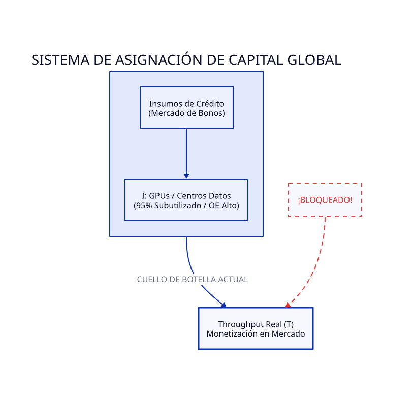
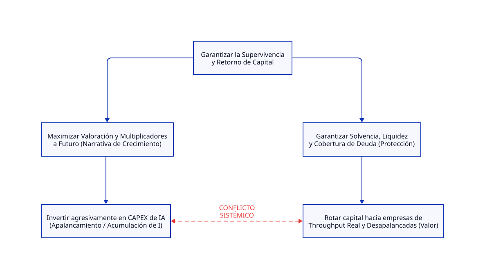

# TERMODINÁMICA FINANCIERA 03: Wall Street y CapEx en IA

**Edición Especial:** La Rotación de Wall Street y el Colapso de la Activación sin Flujo

**Caso:** Exceso de CAPEX en IA, Rotación de Capital y el Mercado de Bonos (CNBC / Jim Cramer - Julio 2026)

https://www.cnbc.com/2026/07/28/jim-cramer-wall-street-fleeing-ai-trade-buying-these-stocks.html

---

## 1. Titular y Resumen Ejecutivo

**Titular:** Wall Street Huye de la "Falsa Restricción": El Capital Migra del $I$ Inflado al Throughput ($T$) Real.

**Resumen Ejecutivo:**

El éxodo de capital desde las Megacaps tecnológicas hiperapalancadas hacia sectores tradicionales no es una simple "rotación defensiva" ni una aversión al riesgo sectorial. Representa el reconocimiento del sistema financiero de que la restricción global ha mutado. La acumulación masiva de infraestructura de IA (GPUs, servidores) financiada con deuda ha generado un exceso de **Inventario ($I$) subutilizado (solo ~5% de uso real)**. Con el mercado de bonos exigiendo rendimientos reales y el costo del capital elevado, Wall Street abandona las métricas de eficiencia local y la especulación de valoración para subordinarse al flujo de caja ($T$) inmediato y desapalancado.

---

## 2. Diagnóstico del Sistema según TOC

* **El Sistema bajo Análisis:** La red global de asignación de capital (Renta Variable vs. Mercado de Deuda Corporativa y Bonos Sovereign).
* **La Restricción del Sistema (Cuello de Botella):** La **Capacidad de Monetización y Generación de Flujo de Caja Real ($T$)**. La restricción ya no es la capacidad física de cómputo o el acceso a chips, sino la integración efectiva de la tecnología en la economía real para producir liquidez neta.

### Impacto en los 3 Parámetros Clave de Goldratt

* **Throughput ($T$):** Estancado en el sector tecnológico. El valor de los tokens y el costo de la hora de GPU caen en los mercados secundarios mientras las ventas finales a clientes corporativos tardan en materializarse. Por el contrario, los sectores tradicionales (bancos, retail, salud) mantienen un $T$ recurrente e instantáneo.
* **Inversión / Inventario ($I$):** Hiperextendido. Miles de millones de dólares en hardware de IA comprados a precios inflados ($30,000–$40,000 USD por GPU) actúan como un **Inventario congelado** con una tasa de depreciación y obsolescencia técnica devastadora (18 a 24 meses).
* **Gasto de Operación ($OE$):** Disparado. El costo del servicio de la deuda emitido en el mercado de bonos, sumado a los costos fijos de energía, mantenimiento, licencias y refrigeración líquida para mantener activo el 95% del hardware subutilizado, está erosionando el margen neto.

---

### Herramienta de Procesos de Pensamiento: Nube de Evaporación (Evaporating Cloud)

* **El Supuesto Falso a Evaporar:** Se asumía la premisa de que *"Incrementar la Inversión ($I$) en infraestructura tecnológica se traduciría automáticamente en Throughput ($T$) a velocidad infinita"*. La exigencia del mercado de bonos rompe este supuesto, forzando la migración del capital hacia [D'].

---

## 3. Dicotomía Clave 1: Contabilidad de Costos Tradicional vs. Contabilidad del Throughput (TA)

| Variable | Contabilidad de Costos Tradicional (GAAP/IFRS) | Contabilidad del Throughput (TOC / TA) |
| --- | --- | --- |
| **Tratamiento del Hardware / GPUs** | Es un **Activo Fijo (CAPEX)**. Se activa en el balance y se amortiza gradualmente a 3–5 años, simulando solvencia y capitalización. | Es **Inventario ($I$) y Gasto ($OE$)**. Al estar utilizado al ~5%, es dinero atrapado que consume recursos (electricidad, intereses) sin generar retorno. |
| **Métrica de Eficiencia** | **Eficiencia Local / Uso de Capacidad.** Busca activar las máquinas/módulos para "repartir los costos fijos", generando sobreproducción de cómputo. | **Tasa de Flujo del Sistema.** La activación sin Throughput es un error catastrófico (*Activación $\neq$ Productividad*). Si el chip no produce $T$, operarlo solo incrementa $OE$. |
| **Evaluación del Apalancamiento** | "Deuda buena" que financia el crecimiento operativo e incrementa el EBITDA proyectado a largo plazo. | **Riesgo Sistémico de Ahogamiento.** La deuda incrementa el $OE$ de forma rígida. Si el $T$ no llega antes del vencimiento del bono, el $I$ se castiga (*write-off*). |

---

## 4. Dicotomía Clave 2: Teoría Monetaria Moderna (MMT) vs. Teoría de Restricciones (TOC)

### Visión de la MMT (Modern Monetary Theory)

* **Premisa:** La restricción financiera nominal no existe mientras exista capacidad de emisión o acceso al crédito respaldado institucionalmente. Los grandes déficit de capital e inversiones en infraestructura de vanguardia (como la IA) son deseables y sostenibles mediante expansión crediticia o apoyo estatal, ya que crean activos productivos en los balances sectoriales.
* **Interpretación de la Noticia:** Consideraría que la salida del *trade* de IA es un reajuste temporal de liquidez en los mercados secundarios y una mala asignación de riesgo crediticio privado que requiere estabilización o refinanciación para evitar un evento deflacionario.

### Visión de la TOC (Theory of Constraints)

* **Premisa:** **La restricción física y operativa siempre manda.** El dinero y el crédito son solo habilitadores del flujo. Inyectar deuda o liquidez en un sistema para comprar activos ($I$) que no están alineados con el verdadero cuello de botella del mercado solo genera desperdicio, inflación de activos y ruinas de capital.
* **Contraste de Supuestos:** Mientras la MMT asume que el crédito financia la capacidad productiva de manera indefinida, la TOC demuestra que la capacidad no explotada (el 95% de GPUs inactivas) destruye la velocidad del dinero dentro de la empresa. La liquidez sin aceleración de $T$ es una trampa de liquidez operativa.

---

## 5. Conclusión y Prescripción Estratégica: Los 5 Pasos de Enfoque de Goldratt

Para que el mercado corporativo y los inversores resuelvan este cuello de botella sistémico, deben aplicarse **Los 5 Pasos de Enfoque**:

1. **IDENTIFICAR la Restricción:**
Reconocer que la restricción del sistema NO es la falta de procesadores ni de centros de datos, sino la **capacidad de integración del cliente final para generar compras recurrentes ($T$)**.
2. **EXPLOTAR la Restricción:**
Extraer el máximo Throughput de la capacidad de IA existente. Maximizar el uso del 5% de las GPUs actualmente activas en aplicaciones de alto valor añadido y cobrables en lugar de seguir adquiriendo nuevos clústeres.
3. **SUBORDINAR Todo lo Demás a la Restricción:**
Detener inmediatamente la emisión de deuda y el gasto de capital ($CAPEX$) destinado a la compra defensiva o por pánico de hardware. Ajustar los presupuestos de TI y los planes de expansión a la velocidad real a la que el mercado absorbe los productos de IA.
4. **ELEVAR la Restricción:**
Si y solo si la infraestructura existente opera al 100% de su capacidad productiva alineada a ventas reales, destinar capital a eliminar los cuellos de botella secundarios (como la canalización de datos, la escasez de energía eléctrica o el desarrollo de software de integración).
5. **PREVENIR la Inercia (Volver al Paso 1):**
Una vez que el mercado absorba el inventario de GPUs y la monetización fluya, evitar caer en la trampa de la Contabilidad de Costos tradicional que volverá a sugerir sobrecomprar activos para "prever costos futuros".
