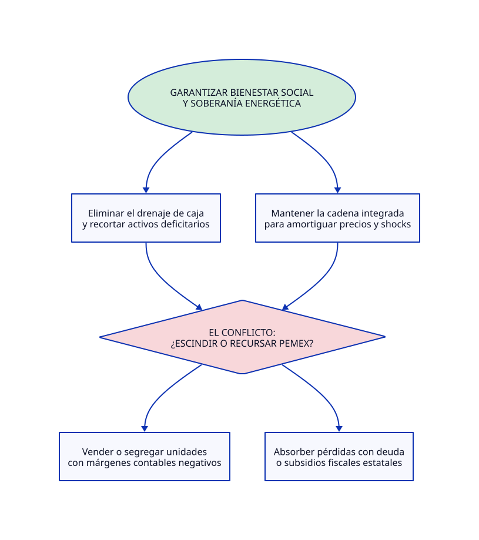

# TERMODINÁMICA FINANCIERA 05: BOLETÍN TOC INSIGHTS

**Análisis Sistémico de PEMEX: La Propuesta de Escisión bajo la Teoría de Restricciones**

[Escision de pemex](https://es-us.noticias.yahoo.com/proponen-escindir-pemex-negocios-deficitarios-050356273.html)

---

### 1. Titular y Resumen Ejecutivo

La consultora Welligence propuso escindir los negocios deficitarios de Petróleos Mexicanos (PEMEX), evaluando a la empresa estatal bajo los criterios de rentabilidad de la contabilidad de costos privada. Desde la Teoría de Restricciones (TOC), desmembrar la infraestructura bajo la premisa de aislar pérdidas ignora el rol sistémico de la petrolera como amortiguador macroeconómico y escudo energético nacional, confundiendo la optimización contable local con la maximización del *Throughput* y el bienestar social.

---

### 2. Diagnóstico del Sistema según TOC

* **Restricción del Sistema (Cuello de Botella):** El cuello de botella operativo y financiero no proviene de la diversidad de unidades de negocio, sino de una restricción dual: la insuficiencia de capital destinado a la perforación y exploración rentable (con una caída drástica en la perforación de pozos), estrangulado por una carga fiscal asfixiante y el desvío de recursos hacia pasivos, deudas y refinación no sincronizada.
* **Parámetros Clave del Sistema:**
* **Throughput ($T$):** El valor energético y la estabilidad macroeconómica provistos al país para amortiguar shocks externos de precios (como la contención de precios de gasolinas frente a tensiones geopolíticas globales).
* **Inversión / Inventario ($I$):** Activos físicos estratégicos (campos de producción, refinerías, red logística) y la deuda financiera acumulada.
* **Gasto de Operación ($OE$):** Costos asociados al mantenimiento de la estructura corporativa, nómina y operación de los complejos.

* **Representación en d2lang de la Nube de Evaporación del Conflicto:**

---

### 3. Dicotomía Clave 1: Contabilidad de Costos Tradicional vs. Contabilidad del Throughput (TA)

* **Visión de la Contabilidad de Costos Tradicional:** Analiza de forma aislada cada segmento de PEMEX (exploración, refinación, petroquímica). Si una unidad reporta márgenes negativos o absorbe flujos, exige su escisión, venta o cierre para "mejorar el EBITDA corporativo" y reducir costos por componente u operación local.
* **Visión de la Contabilidad del Throughput (TA):** Advierte que la reducción de costos locales ($OE$) o la eliminación de activos de soporte bajo criterios fragmentados puede colapsar el flujo global del sistema. Un segmento con déficit contable interno puede operar como el amortiguador indispensable que protege el *Throughput* macroeconómico y evita que la volatilidad de precios colapse el aparato productivo nacional.

---

### 4. Dicotomía Clave 2: Teoría Monetaria Moderna (MMT) vs. Teoría de Restricciones (TOC)

* **Visión MMT:** Al tratarse de un Estado con soberanía monetaria, las restricciones financieras nominales son secundarias; los apoyos fiscales, la absorción de deudas o los déficits operativos en empresas públicas no están limitados por ingresos tributarios previos, sino por los recursos reales disponibles y el riesgo inflacionario.
* **Visión TOC:** El dinero es simplemente un medio facilitador; la restricción fundamental es física y operativa. Incluso con soberanía monetaria, si la capacidad de extracción y refinación (la verdadera restricción del sistema energético) está estrangulada por una asignación deficiente de recursos hacia gastos no productivos en lugar de pozos de alta rentabilidad, la inyección de liquidez o el endeudamiento solo elevan el inventario financiero ($I$) y generan ruido inflacionario sin acelerar el flujo físico de bienestar.

---

### 5. Conclusión y Prescripción Estratégica (5 Pasos de Enfoque de Goldratt)

1. **Identificar la Restricción:** Reconocer que el cuello de botella no es la estructura integrada de la empresa pública, sino la distorsión en la asignación de recursos (fondos desviados al saneamiento de pasivos e impuestos en lugar de la perforación de campos altamente productivos).
2. **Explotar la Restricción:** Maximizar la eficiencia operativa de los campos y activos actuales que concentran la mayor parte de la producción para asegurar el suministro energético interno frente a la volatilidad geopolítica.
3. **Subordinar el Resto del Sistema:** Alinear la política fiscal gubernamental para detener la extracción excesiva de caja (vía impuestos confiscatorios o uso como caja chica), subordinando las metas de recaudación de corto plazo a la estabilidad del flujo energético nacional.
4. **Elevar la Restricción:** Inyectar capital de inversión ($I$) de forma directa y prioritaria en la perforación, tecnología y mantenimiento de los campos rentables, ampliando la capacidad de producción del amortiguador macroeconómico.
5. **Prevenir la Inercia:** Evitar la aplicación ciega de dogmas corporativos privados que dictan la fragmentación de empresas estatales bajo métricas de contabilidad de costos sin evaluar el impacto sistémico sobre la estabilidad del país y el bienestar social.
