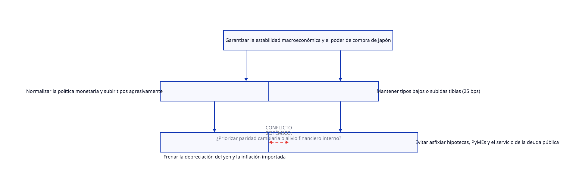

# Termodinamica Financiera 06: El Espejismo de los 25 Puntos Base del Banco de Japón

[BoJ sube a 1.25](https://www.reuters.com/world/asia-pacific/view-investors-react-boj-raising-interest-rates-31-year-high-2026-09-18/)

## 1. Resumen Ejecutivo

La decisión del Banco de Japón (BOJ) de elevar los tipos de interés en 25 puntos base hasta el 1.25% —un máximo de 31 años— fue interpretada por los mercados como una señal "tibia". En lugar de estabilizar el sistema, esta medida cosmética profundiza la debilidad del yen, estimula la permanencia del *carry trade* y obliga al Ministerio de Finanzas a sopesar la venta masiva de bonos del Tesoro de EE. UU., provocando ondas expansivas de inestabilidad en la liquidez global.

---

## 2. Diagnóstico del Sistema según TOC

La restricción fundamental de Japón no es el nivel nominal de su tasa de interés, sino **la vulnerabilidad estructural de su cadena de valor frente a la dependencia energética exterior** y la incapacidad de su capacidad productiva interna para generar un flujo neto positivo (*Throughput*) ante la erosión de su moneda.

* **Throughput ($T$):** Estrangulado por el encarecimiento de los insumos dolarizados (energía y materias primas) debido a un yen debilitado artificialmente.
* **Inversión / Inventario ($I$):** Capital inmovilizado en desequilibrios cambiarios, bonos estatales y posiciones especulativas masivas en dólares apalancadas en yenes.
* **Gasto de Operación ($OE$):** Incrementado marginalmente por la subida de tipos (mayor coste de servicio de la deuda y de las hipotecas), sin ensanchar la capacidad del cuello de botella real de la economía.

---

## 3. Dicotomía Clave 1: Contabilidad de Costos Tradicional vs. Contabilidad del Throughput (TA)

* **Visión de la Contabilidad de Costos Tradicional:** Evalúa la subida de 25 puntos base como un ajuste porcentual lineal de los costes de financiación. Los analistas tradicionales miden la "eficiencia" de la medida calculando el diferencial de tasas de interés puro frente a la Reserva Federal, asumiendo que los mercados responden estáticamente a hojas de cálculo de optimización de costes de endeudamiento.
* **Visión de la Contabilidad del Throughput (TA):** Bajo la perspectiva de Goldratt, los mercados no responden a la magnitud numérica de un ajuste local de tasas, sino al **efecto sistémico sobre la velocidad del flujo financiero y comercial**. Un incremento de 25 bps es un movimiento local cosmético incapaz de alterar el rendimiento de las restricciones del sistema productivo japonés. Mientras la generación de valor neto a través de exportaciones reales no supere el coste de los cuellos de botella externos, manipular el tipo de interés nominal es simplemente mover dinero de bolsillo sin acelerar el flujo real de riqueza.

---

## 4. Dicotomía Clave 2: Teoría Monetaria Moderna (MMT) vs. Teoría de Restricciones (TOC)

* **Visión MMT:** Sostiene que, al ser Japón un emisor soberano de su propia moneda, no enfrenta restricciones financieras nominales ni riesgo de insolvencia en yenes. Desde este enfoque, el foco no debería ser subir tipos para "defender" la paridad cambiaria o atraer capitales especulativos, sino gestionar los recursos reales de la economía mediante política fiscal, utilizando los impuestos para modular la demanda agregada si esta superara la capacidad productiva real.
* **Visión TOC:** Aunque la MMT acierta en que el dinero soberano no tiene un límite financiero nominal, ignora la **restricción física de los recursos y la dependencia crítica del exterior**. Japón importa prácticamente la totalidad de su energía y materias primas. Si el poder de compra del yen colapsa, el *Throughput* físico se desmorona porque se requieren más bienes y exportaciones reales solo para pagar la misma factura energética básica. Para TOC, la restricción no es la capacidad contable del emisor soberano, sino la **capacidad del sistema físico para generar valor neto real** frente a un entorno exterior desfavorable.

---

## 5. Conclusión y Prescripción Estratégica (5 Pasos de Enfoque de Goldratt)

1. **Identificar la restricción:** El cuello de botella real de Japón no es la cotización del yen ni la falta de reservas, sino la **baja competitividad estructural y la dependencia energética exterior**, agravadas por un diferencial de tasas insostenible con Occidente.
2. **Explotar la restricción:** Maximizar la eficiencia de los recursos actuales reconociendo que las intervenciones físicas en el mercado de divisas (como la quema de bonos de EE. UU.) solo compran tiempo, pero no generan valor por sí mismas.
3. **Subordinar todo lo demás a la restricción:** Alinear la política fiscal y monetaria. Si el BOJ actúa con timidez (subidas de 25 bps) mientras el Ministerio de Finanzas quema bonos del Tesoro estadounidense para defender el tipo de cambio, las políticas entran en contradicción sistémica, anulando mutuamente sus esfuerzos.
4. **Elevar la restricción:** Romper el ciclo de dependencia energética modernizando la matriz productiva interna y permitiendo una normalización de tasas decidida que atraiga flujos de capital real en lugar de depender de parches artificiales.
5. **Prevenir la inercia:** Abandonar el dogma de que "una moneda débil siempre beneficia automáticamente a las exportaciones", una métrica obsoleta de la contabilidad de costos local que ignora el daño neto que la inflación importada inflige al *Throughput* sistémico global.
