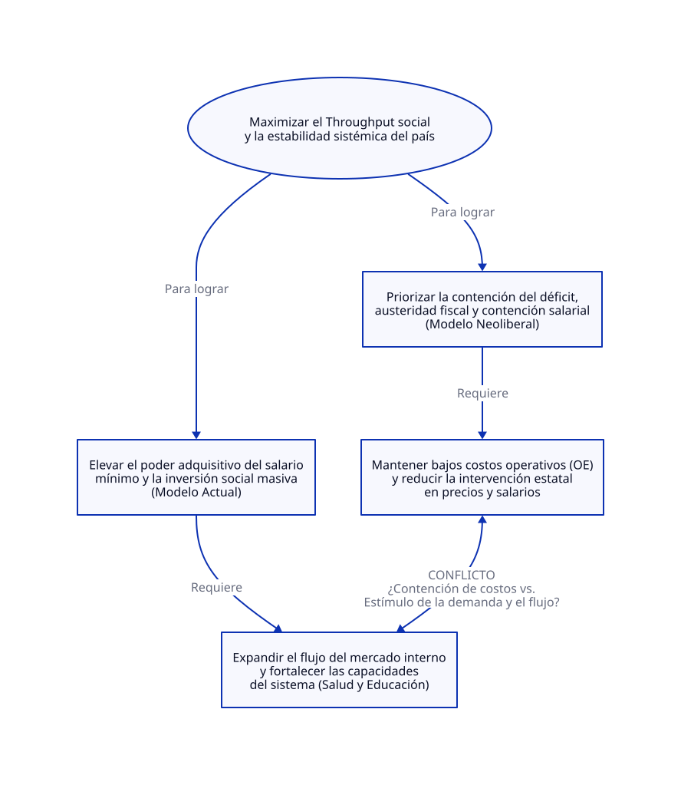

# Termodinámica Financiera 07: Políticas Económicas.

**Análisis Sistémico de Políticas Económicas bajo la Teoría de Restricciones (TOC)**

[Políticas Económicas](https://www.eleconomista.com.mx/economia/edgar-amador-responde-guillermo-ortiz-modelo-actual-dado-mejores-resultados-neoliberal-20260921-834537.html)

---

## 1. Titular y Resumen Ejecutivo

**El Verdadero Cuello de Botella del Estado: Entre la Contención Contable y el Flujo de Throughput Social**

El debate entre el modelo neoliberal y el actual no es una simple disputa ideológica sobre porcentajes del PIB, sino un choque de paradigmas sobre cómo se gestiona el sistema económico de una nación. Mientras el modelo neoliberal priorizó la optimización local del gasto operativo ($OE$) y la contención salarial —destruyendo el mercado interno y disparando la deuda pública ($I$)—, el modelo actual utiliza el salario mínimo y la inversión social como variables de sincronización para elevar el Throughput ($T$) social y reducir la pobreza multidimensional.

---

## 2. Diagnóstico del Sistema según TOC

Bajo la Teoría de Restricciones, una economía nacional no es una suma de balances contables aislados, sino un flujo continuo interconectado. La restricción histórica de México ha radicado en la subutilización de su mercado interno debido a la depresión sistemática del poder adquisitivo.

La siguiente Nube de Evaporación expone el conflicto fundamental entre ambos modelos de gestión gubernamental:

---

## 3. Dicotomía Clave 1: Contabilidad de Costos Tradicional vs. Contabilidad del Throughput (TA)

* **Contabilidad de Costos Tradicional (Modelo Neoliberal):** Concibe los salarios y el gasto público en salud/educación como puros costos variables y de operación ($OE$) que deben minimizarse. Bajo esta lógica, deprimir los salarios mínimos y recortar el gasto social (llevándolo a mínimos históricos como el 2.1% del PIB en 1996) se percibe erróneamente como un "ahorro" y una ganancia de eficiencia. Sin embargo, ignora que asfixiar el poder adquisitivo colapsa el consumo y obliga a rescates financieros masivos (como el Fobaproa) que disparan exponencialmente la Inversión/Inventario ($I$ en forma de deuda pública).
* **Contabilidad del Throughput (Modelo Actual):** Reconoce que el salario mínimo no es un costo a minimizar, sino una **señal de sincronización** que acelera la velocidad del flujo monetario y transaccional en el mercado interno. El gasto en salud y bienestar no drena al Estado, sino que eleva la capacidad productiva y la robustez del sistema, maximizando el Throughput ($T$) social.

---

## 4. Dicotomía Clave 2: Teoría Monetaria Moderna (MMT) vs. Teoría de Restricciones (TOC)

* **Visión MMT:** Analiza la soberanía monetaria enfatizando que un Estado emisor de su propia moneda no enfrenta restricciones financieras nominales ni de "bancarrota", sino límites de recursos reales y presión inflacionaria. Sostiene que el gasto público deficitario es el motor necesario para proveer liquidez y empleo cuando el sector privado desinvierte.
* **Visión TOC:** Complementa y acota el análisis al recordar que, aun con soberanía monetaria, **el dinero es solo un habilitador del flujo físico y productivo**. Si el Estado inyecta recursos o emite moneda sin que exista la capacidad estructural real en la restricción del sistema (infraestructura, seguridad, cadenas de suministro o energía), el resultado no es más valor real, sino inflación y acumulación de ruido e inventarios improductivos. El modelo actual acierta al ligar la expansión del gasto a la recuperación tangible de capacidades de la base (reducción de la pobreza multidimensional), evitando que el recurso se disperse en ineficiencias.

---

## 5. Conclusión y Prescripción Estratégica (5 Pasos de Enfoque de Goldratt)

Aplicando los **5 Pasos de Enfoque** a la gestión macroeconómica actual del país:

1. **Identificar la restricción:** El cuello de botella ya no es meramente la falta de poder adquisitivo básico (parcialmente aliviado), sino los rezagos estructurales en **seguridad pública, certidumbre jurídica, infraestructura logística y productividad sistémica**.
2. **Explotar la restricción:** Maximizar el rendimiento de la infraestructura y los programas sociales actuales mediante la digitalización, la simplificación regulatoria y la eficiencia en la ejecución del gasto público.
3. **Subordinar todo lo demás a la restricción:** Alinear la política fiscal, educativa y comercial (incluyendo la revisión del T-MEC) para que sirvan de soporte directo a la seguridad territorial y al desarrollo de proveeduría nacional.
4. **Elevar la restricción:** Destinar inversión de capital ($I$) estratégica y masiva a romper los cuellos de botella físicos (energía limpia, polos de desarrollo regional, educación tecnológica y combate frontal a la extorsión y la violencia).
5. **Prevenir la inercia:** Evitar caer en la complacencia de los indicadores históricos superados; el entorno global y la relocalización de cadenas (*nearshoring*) exigen mover permanentemente la atención hacia las nuevas restricciones de competitividad internacional.

